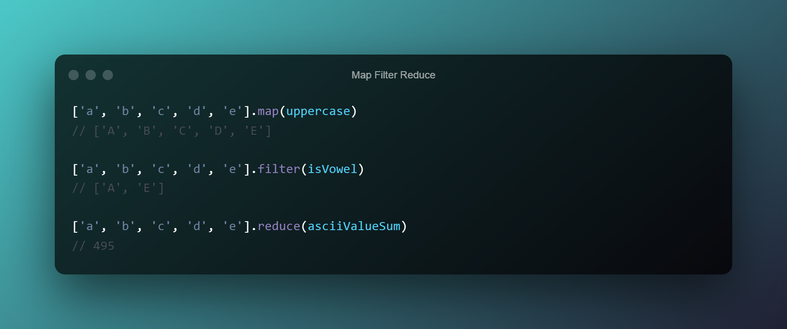

# Map, Filter, Reduce and Find



## Functional programming

Functional programming is a programming paradigm where the output
value of a function depends only on the arguments that are passed
to the function. 

Calling a function will always produce the same result, 
no matter the amount of times you call it. 
These functions are known as pure functions.

In Javascript we have map, filter and reduce, 
all functions that given an initial list (array of things), 
transform it into something else, 
while keeping that same original list intact.

Functional techniques can help you write more declarative code
 that is easier to understand at a glance, refactor, and test.
This looks pretty clean, shorter, expressive, concise code, 
less error-prone, easier to maintain, and easier to debug. 
We are telling the computer what we want it to do rather than how to do it.

The declarative approach is easily optimizable at the complier end 
and also has fewer side effects.


## Map, filter, Reduce
Why use map, filter and reduce?

- You work directly with the current value instead of accessing
 it through an index (i.e array[i]);

- Avoid mutation of the original array, 
therefore, minimizing side-effects;

- No need to manage a for loop;

- No more creating empty arrays and push stuff into them;

:::info

Whenever you have a task which involves:
- translating elements
- finding cumulative values
- building subsets based on conditions.

It is an indication to use **map**, **filter** or **reduce**.

:::


## Map

Map is used when you have an array of stuff and you want to do something
for every item in that array.


take an array and modify every element in it in exactly the same way.
You want to translate/map all elements in an array to another set of values.

Map receives a callback as an argument. 
That callback is then given the current value of the iteration, 
the index of the iteration and the original array from which map was called.


```js title="mapLetters.js"

    const letters = ['a', 'b', 'd', 'e']
    const capitalisedLetters = letters.map(letter => letter.toUpperCase())
    console.log(capitalisedLetters)
    // ['A', 'B', 'C', 'D', 'E']
```

<details>
  <summary>How it works?</summary>
  <div>
    Traverses the array from left to right invoking a callback function on each 
    element with parameters (below). For each callback the value returned becomes
    the element in the new array. After all elements have been traversed map()
    returns the new array with all the translated elements.
  </div>
</details>

### Advantages

- You don't have to manage the state of the for loop yourself.

- You can operate on the element directly, 
rather than having to index into the array.

- You don't have to create a new array and push into it. 
Map returns the finished product all in one go, 
so we can simply assign the return value to a new variable.

- It returns an array, so you can chain it with other array methods.

- It returns an array with the finished product, 
rather than requiring us to mutate an array inside the loop. 

Keeping the number of places where you modify state to an absolute minimum is an important tenet of functional programming. It makes for safer and more intelligible code.

:::danger
**Always make sure your callback contains a return statement!**

The callback you pass to map must have an explicit return statement, 
or map will spit out an array full of undefined
:::


## Filter 

The `filter` method creates a new array with all elements that pass the test
implemented by the provided function.

_You want to use this whenever you want to remove unwanted elements based on a condition._

Filter receives the same arguments as map, 
and works very similarly. The only difference is that the callback needs to 
return either true or false. 
If it returns true then the array keeps that element and 
if it returns false the element is filtered out.


Just like map, filter lets us:
- avoid mutating an array inside a forEach or for loop
- assign its result directly to a new variable, 
rather than push into an array we defined elsewhere


:::danger
**Always make sure your callback returns a boolean value**

With filter, you must make sure it returns a boolean value.

If you forget your return statement, your callback will return undefined,
which filter will unhelpfully coerce to false. 
Instead of throwing an error, it will silently return an empty array!

:::

<details>
  <summary>How it works?</summary>
  <div>
    Like <b>map</b> it traverses the array from left to right invoking
    a callback function on each element. The returned value must be
    a <b>boolean</b> identifying whether the element will be kept or discarded.
    After all elements have been traversed <b>filter</b> returns a new array
    with all elements that returned true.
  </div>
</details>


## Reduce


The reduce method applies a function against an accumulator
and each element in the array (from left to right) to reduce
it to a single value.


You want to find a cumulative or concatenated value based
on elements across the array.
Like map it traverses the array from left to right invoking a callback
function on each element. The value returned is the cumulative value
passed from callback to callback. After all elements have been traversed
reduce returns the cumulative value.


map creates a new array by transforming every element in an array individually.
 filter creates a new array by removing elements that don't belong.
  reduce, on the other hand, takes all of the elements in an array and reduces them into a single value.


Notice that the callback gets a previous value on each iteration.
 On the first iteration, there is no previous value. 
 This is why you have the option to pass reduce an initial value: It acts as the "previous value"
  for the first iteration, when there otherwise wouldn't be one.
Finally, bear in mind that reduce returns a single value, not an array containing a single item.


The three big gotchas with reduce are:
forgetting to return
forgetting an initial value
expecting an array when reduce returns a single value

REMEMBER THE RETURN STATEMENT IN THE CALLBACK;

:::danger

Keep in mind that reduce always returns a single value, not always a single number. 

If you reduce an array of arrays, for instance, it will return a single array.
:::


